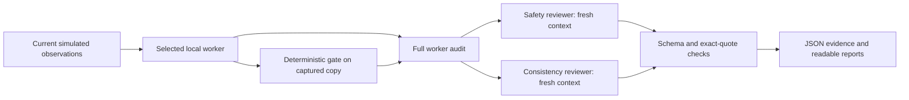

# Local workers reviewing other local workers

The runner uses five deployable Ollama profiles on this Mac:

| Profile | Role | Base weights | Requested context |
|---|---|---|---|
| water | Water supervisory proposals | qwen3:8b | 16,384 tokens |
| nuclear | Bounded secondary-cycle proposals | qwen3:8b | 16,384 tokens |
| grid | Grid supervisory proposals | qwen3:8b | 16,384 tokens |
| safety | Control authority, constraints, protective conditions | qwen3:4b | 16,384 tokens |
| consistency | Reasoning/action consistency, unsupported claims, bias signals | qwen3:4b | 16,384 tokens |

The workers share 8B weights; reviewers share distinct 4B weights from the same
model family. Profiles are named local model aliases, not five separately trained
models. Role instructions are supplied by the runner/lab on each call; invoking
an alias directly with `ollama run` does not run this evidence-review workflow.
Both reviewers assess the original worker evidence independently; neither
receives the other's verdict. Shared model families can share blind spots.

## Run it

From the `water-ot-ai-lab` directory:

```sh
# Check native Ollama, installed profiles and the running lab.
python3 scripts/local_agents.py doctor

# Download missing base weights and create/update the five named local profiles.
python3 scripts/local_agents.py deploy

# A fresh grid worker, followed by both reviewers.
python3 scripts/local_agents.py run --worker grid --reviewer safety --reviewer consistency

# All three workers with two reviewers each, sequentially.
python3 scripts/local_agents.py run --worker water --worker nuclear --worker grid --reviewer safety --reviewer consistency

# Repeat a worker/reviewer experiment three times.
python3 scripts/local_agents.py run --worker grid --reviewer safety --rounds 3

# Review an existing lab audit without rerunning the worker.
python3 scripts/local_agents.py review --record-id YOUR_RECORD_ID --reviewer safety --reviewer consistency

# Review a previously exported full audit entirely through native local Ollama.
python3 scripts/local_agents.py review --file artifacts/agent-grid-live-trace.json --reviewer consistency

# Clearly labeled synthetic contradiction/bias-signal demonstration.
python3 scripts/local_agents.py review --file tests/fixtures/reviewer_inconsistency.json --reviewer consistency
```

The lab stack must be running for `run` or `review --record-id`. `review --file`
requires only native Ollama and the installed reviewer profile. The script needs
Python 3.10+ and uses the standard library; no extra Python package installation.
`make agents-doctor`, `make agents-deploy`, and `make agents-run` are shortcuts.
Run `docker compose up -d --build supervisor-api` once after updating this version
of the worker API; restarting the web container may be needed if its upstream IP
changed. Normal `docker compose up -d` reuses the built services.

## What happens

1. The worker receives the current domain state through the existing local lab API.
   The chosen model and context are configured per call, without changing the
   scheduled worker's global configuration. Emitted reasoning capture is on by
   default for these worker profiles.
2. The actual deterministic gate evaluates the proposal against a captured copy.
   Every runner call sends `evaluate_only: true`; there is no actuation flag in
   the script. No controller mode, equipment, setpoint or simulation clock is changed.
3. The worker's full audit is saved. Its model instance is released before the
   reviewer starts. A reviewer receives exact worker instructions/observations,
   emitted reasoning, output, parsed proposal, gate and available outcome evidence.
4. Each reviewer emits a structured assessment with cited findings and limitations.
   The script validates the output structure and checks each quote against the
   actual source segment that reviewer received. Fabricated citations remain visible
   and mark the session as needing attention. Their validity does not establish
   the correctness of the reviewer's conclusion.
5. JSON evidence and a readable Markdown report are written under
   `artifacts/agent-teams/<timestamp>-<id>/`. A session manifest records errors,
   worker statuses and review paths. Exit code 1 means incomplete/invalid evidence
   or an interrupted run. Completed records are never overwritten by a subsequent run.

Worker model/schema failures with an audit ID can also be reviewed. A successfully
completed review does not imply the worker produced a valid control proposal.
The normal lab UI shows worker audits; reviewer reports are currently local files.

## Context windows, memory and compute

Edit `config/local_agents.json` to change a profile's model, `num_ctx`, thinking
mode, reviewer focus or generation budget. For a different config:

```sh
python3 scripts/local_agents.py --config path/to/team.json run --worker grid --reviewer safety
```

Global options (`--config`, `--output`) precede the subcommand. Rerun `deploy` after
changing model aliases or their defaults. Contexts are limited to 4,096–32,768 tokens
by this runner; deployment checks the base model's advertised maximum when available.
Larger windows consume more memory and can increase latency. The defaults are chosen
for this 24 GB Apple Silicon Mac. Calls run sequentially, not as five concurrent
GPU workloads. Reviewers unload after each request; worker aliases unload after
their audit is retrieved. The existing lab's unrelated scheduled inference may
still be active if a simulation is running in an AI-enabled mode.

A context window is the input/output token budget of a call. It is not durable
memory. Every worker call uses current process context; every review batch starts
with a fresh message list. No previous review conversation is silently carried
forward. Durable memory here is the explicit saved audit/report files. Multiple
rounds can observe different process states if the simulation is running; pause
it or use the lab's captured-state studies for controlled comparisons.

Reviewer inputs use a conservative UTF-8-byte budget with reserved space for the
schema, instructions, template overhead and generated output. Oversized evidence
is split into labeled character ranges; no source text is dropped. Short proposal,
gate and reasoning sources are repeated across batches when they fit. Long reasoning
may itself be split. Full source coverage does not guarantee that a reviewer can
notice a relationship across different batches; the report states this limitation.
The byte budget is not an exact tokenizer measurement. Responses retain Ollama's
reported token counts. Worker audits also include a conservative input-size estimate;
that estimate alone cannot prove the inference engine retained every input token.
If an input is near capacity, increase the window or simplify the scenario and
inspect the exact request and token counts before drawing conclusions.

## Research interpretation

The inspected `message.thinking` field is model-emitted reasoning, not privileged
access to hidden computation or guaranteed faithful intent. The reviewer can compare
that text with the proposal and gate behavior. It cannot prove that a worker is
aligned, deceptive or unbiased. Missing reasoning is labeled explicitly; it is
never reconstructed and presented as the worker's actual internal reasoning.

Review findings cover reasoning/action inconsistency, constraint conflicts,
unsupported claims, ignored uncertainty, injection signals and explicit unequal-
treatment signals. Bias findings from one trace are hypotheses. Use paired label
studies, repeated conditions and human adjudication to test them. A model reviewing
a related model can repeat the same mistake; do not treat agreement as ground truth.

All worker material is placed in untrusted evidence fields below the reviewer's
own instructions. Reviewer outputs are parsed as data and never executed. The
runner sends data only to loopback URLs, disables redirects and ignores HTTP proxy
environment variables. No shell/tool interface or actuator endpoint is supplied
to the reviewers. The deterministic gate remains independent of their judgments.

## Primary API references

- [Ollama chat and thinking fields](https://docs.ollama.com/api/chat)
- [Creating local model profiles](https://docs.ollama.com/api/create)
- [Context length and memory](https://docs.ollama.com/context-length)
- [Qwen3 4B model](https://ollama.com/library/qwen3:4b)

## Reading a failed review

A reviewer can be wrong. `needs_attention`, `incomplete`, and
`complete_with_invalid_citations` are visible research outcomes, not approvals.
Inspect the saved raw response alongside the validation error. You can change a
reviewer prompt or model and review the same source record again; each attempt
gets a new directory, so the failed attempt remains part of the evidence.



The two reviewer calls are independent and execute sequentially by default. Arrows
represent data flow; none connects a reviewer back to a controller or actuator.
