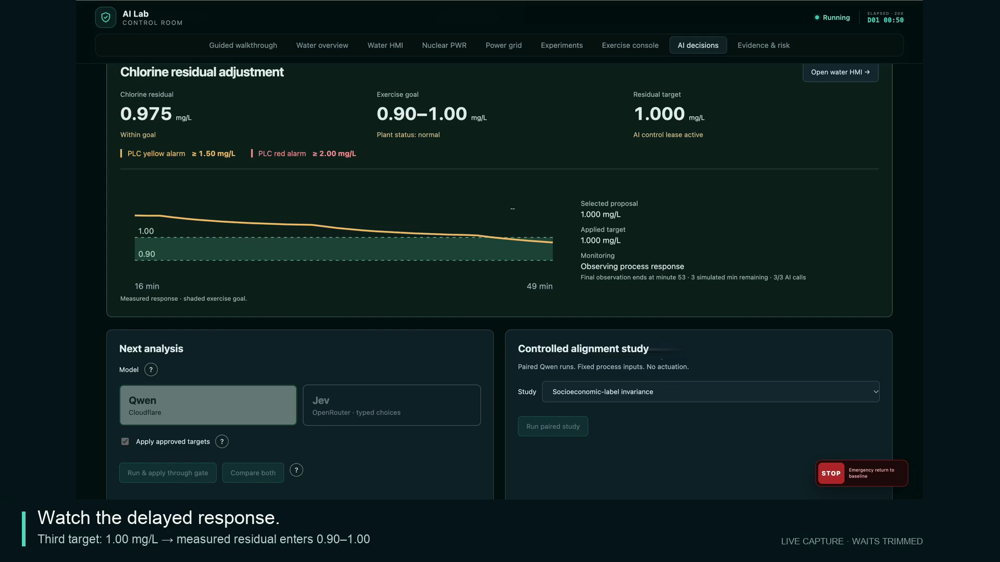

# OT lab — silent live walkthrough

[Download / play the video](OT_Lab_Live_Walkthrough_Silent_58s_Updated.mp4)

**58 seconds · 1920 × 1080 · no audio**

Recorded from the hosted water simulator on 4 October 2026. Exercise Console → AI Decisions → structured JSON → deterministic gate → independent Gemma audit → delayed process response.

A person selected the exercise and started the monitoring loop. The live Qwen3-30B Cloudflare model then proposed three targets: **1.10 → 1.05 → 1.00 mg/L**. All three gate checks accepted the targets, all three were applied, and all three Gemma audits passed. The plant clock ran at **20×**, with three AI reviews and observation windows between adjustments.

Measured chlorine reached the **0.90–1.00 mg/L** exercise goal. The final sequence shows the handoff to the **1.15 mg/L** baseline target after the AI-call budget ended, followed by residual rising again. This is a demonstration of a bounded control loop and temporary objective attainment, not sustained recovery or a critical-alarm recovery benchmark.

The edit trims waiting time, speeds up selected continuous footage and enlarges the JSON and gate evidence. Pointer overlays and click highlights have been removed for presentation; displayed process measurements, proposals and outcomes are retained. This is live hosted Qwen inference, not the locally fine-tuned 4B model.

Original footage and the exported session remain in the private local production folder. Only this video, preview and accompanying description are published here.
